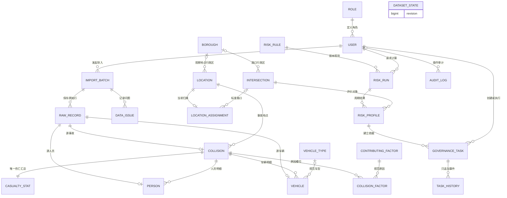

# M1概念E-R图

概念图表示主要业务及支撑对象；物理主键/外键见[关系模型](relational.md)。观察地点、人工确认路口和风险画像分别代表来源事实、维护对象及版本化派生指标。

```mermaid
erDiagram
    ROLE ||--o{ USER : 定义角色
    USER ||--o{ IMPORT_BATCH : 发起导入
    IMPORT_BATCH ||--o{ RAW_RECORD : 保存原始行
    IMPORT_BATCH ||--o{ DATA_ISSUE : 记录问题
    RAW_RECORD ||--o| COLLISION : 源事故
    RAW_RECORD ||--o| PERSON : 源人员
    RAW_RECORD ||--o| VEHICLE : 源车辆
    BOROUGH |o--o{ LOCATION : 观察地点行政区
    LOCATION ||--o{ COLLISION : 事故地点
    LOCATION ||--o| LOCATION_ASSIGNMENT : 当前归属
    INTERSECTION |o--o{ LOCATION_ASSIGNMENT : 标准路口
    BOROUGH |o--o{ INTERSECTION : 路口行政区
    COLLISION ||--|| CASUALTY_STAT : 唯一伤亡汇总
    COLLISION ||--o{ PERSON : 人员明细
    COLLISION ||--o{ VEHICLE : 车辆明细
    VEHICLE_TYPE |o--o{ VEHICLE : 规范车型
    COLLISION ||--o{ COLLISION_FACTOR : 原因槽位
    CONTRIBUTING_FACTOR ||--o{ COLLISION_FACTOR : 规范原因
    RISK_RULE ||--o{ RISK_RUN : 版本规则
    USER ||--o{ RISK_RUN : 请求计算
    RISK_RUN ||--o{ RISK_PROFILE : 周期结果
    INTERSECTION ||--o{ RISK_PROFILE : 评价对象
    RISK_PROFILE ||--o{ GOVERNANCE_TASK : 建立依据
    USER ||--o{ GOVERNANCE_TASK : 创建或执行
    GOVERNANCE_TASK ||--o{ TASK_HISTORY : 只追加事件
    USER |o--o{ AUDIT_LOG : 操作审计
    DATASET_STATE {
        bigint revision
    }
```

伤亡汇总来自CRASHES，不从人员明细推算。治理任务为课程模拟。DATASET_STATE为全库修订单例，用于识别画像是否过期。
