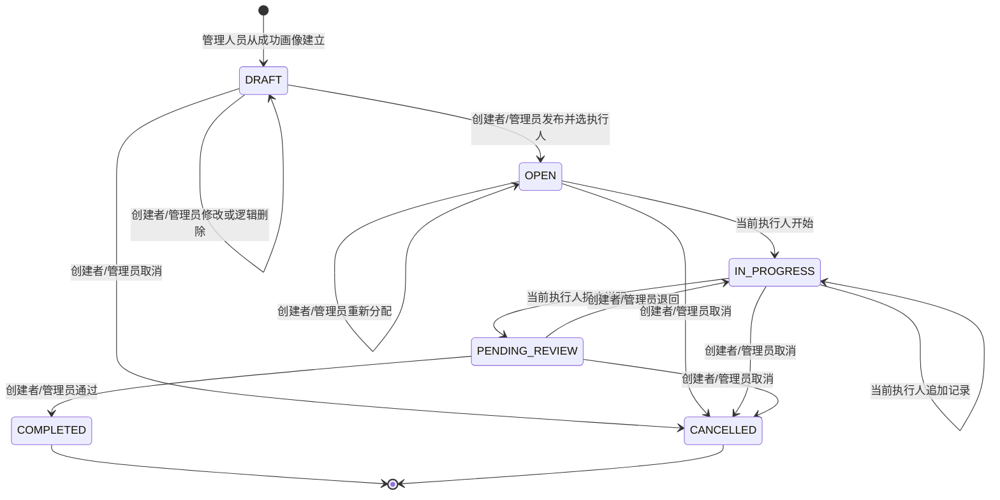

# 治理工单状态与权限

以下均为课程模拟业务。执行人不能复核自己执行的任务。

```mermaid
stateDiagram-v2
    [*] --> DRAFT: 管理人员从成功画像建立
    DRAFT --> DRAFT: 创建者/管理员修改或逻辑删除
    DRAFT --> OPEN: 创建者/管理员发布并选执行人
    OPEN --> OPEN: 创建者/管理员重新分配
    OPEN --> IN_PROGRESS: 当前执行人开始
    IN_PROGRESS --> IN_PROGRESS: 当前执行人追加记录
    IN_PROGRESS --> PENDING_REVIEW: 当前执行人提交说明
    PENDING_REVIEW --> IN_PROGRESS: 创建者/管理员退回
    PENDING_REVIEW --> COMPLETED: 创建者/管理员通过
    DRAFT --> CANCELLED: 创建者/管理员取消
    OPEN --> CANCELLED: 创建者/管理员取消
    IN_PROGRESS --> CANCELLED: 创建者/管理员取消
    PENDING_REVIEW --> CANCELLED: 创建者/管理员取消
    COMPLETED --> [*]
    CANCELLED --> [*]
```

UNKNOWN 画像仅支持现场调查 DRAFT；逻辑删除后保留历史但禁止新动作。每次动作通过同一数据库事务更新工单版本和追加同序号历史。
