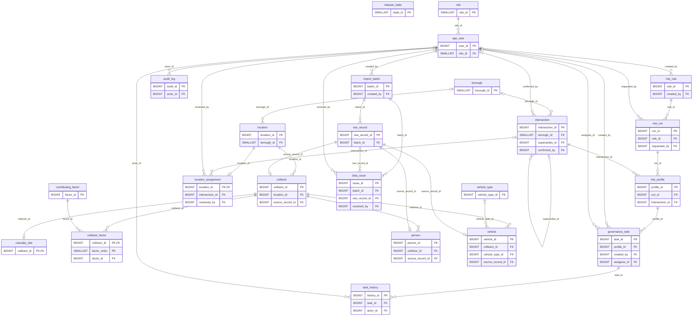

# M1关系模型

23张基础关系，仅显示主键和外键。完整字段、类型与约束见[数据字典](../data_dictionary.md)。事故与伤亡行的一对一由延迟触发器补强。人员与车辆仅按事故关联，不建立臆测的直接关系。

```mermaid
erDiagram
    borough {
        SMALLINT borough_id PK
    }
    contributing_factor {
        BIGINT factor_id PK
    }
    dataset_state {
        SMALLINT state_id PK
    }
    role {
        SMALLINT role_id PK
    }
    vehicle_type {
        BIGINT vehicle_type_id PK
    }
    app_user {
        BIGINT user_id PK
        SMALLINT role_id FK
    }
    location {
        BIGINT location_id PK
        SMALLINT borough_id FK
    }
    audit_log {
        BIGINT audit_id PK
        BIGINT actor_id FK
    }
    import_batch {
        BIGINT batch_id PK
        BIGINT created_by FK
    }
    intersection {
        BIGINT intersection_id PK
        SMALLINT borough_id FK
        BIGINT supersedes_id FK
        BIGINT confirmed_by FK
    }
    risk_rule {
        BIGINT rule_id PK
        BIGINT created_by FK
    }
    location_assignment {
        BIGINT location_id PK, FK
        BIGINT intersection_id FK
        BIGINT reviewed_by FK
    }
    raw_record {
        BIGINT raw_record_id PK
        BIGINT batch_id FK
    }
    risk_run {
        BIGINT run_id PK
        BIGINT rule_id FK
        BIGINT requested_by FK
    }
    collision {
        BIGINT collision_id PK
        BIGINT location_id FK
        BIGINT source_record_id FK
    }
    data_issue {
        BIGINT issue_id PK
        BIGINT batch_id FK
        BIGINT raw_record_id FK
        BIGINT resolved_by FK
    }
    risk_profile {
        BIGINT profile_id PK
        BIGINT run_id FK
        BIGINT intersection_id FK
    }
    casualty_stat {
        BIGINT collision_id PK, FK
    }
    collision_factor {
        BIGINT collision_id PK, FK
        SMALLINT factor_order PK
        BIGINT factor_id FK
    }
    governance_task {
        BIGINT task_id PK
        BIGINT profile_id FK
        BIGINT created_by FK
        BIGINT assignee_id FK
    }
    person {
        BIGINT person_id PK
        BIGINT collision_id FK
        BIGINT source_record_id FK
    }
    vehicle {
        BIGINT vehicle_id PK
        BIGINT collision_id FK
        BIGINT vehicle_type_id FK
        BIGINT source_record_id FK
    }
    task_history {
        BIGINT history_id PK
        BIGINT task_id FK
        BIGINT actor_id FK
    }
    role ||--o{ app_user : "role_id"
    borough |o--o{ location : "borough_id"
    app_user |o--o{ audit_log : "actor_id"
    app_user ||--o{ import_batch : "created_by"
    borough |o--o{ intersection : "borough_id"
    intersection |o--o{ intersection : "supersedes_id"
    app_user |o--o{ intersection : "confirmed_by"
    app_user |o--o{ risk_rule : "created_by"
    location ||--o| location_assignment : "location_id"
    intersection |o--o{ location_assignment : "intersection_id"
    app_user |o--o{ location_assignment : "reviewed_by"
    import_batch ||--o{ raw_record : "batch_id"
    risk_rule ||--o{ risk_run : "rule_id"
    app_user ||--o{ risk_run : "requested_by"
    location ||--o{ collision : "location_id"
    raw_record ||--o| collision : "source_record_id"
    import_batch ||--o{ data_issue : "batch_id"
    raw_record |o--o{ data_issue : "raw_record_id"
    app_user |o--o{ data_issue : "resolved_by"
    risk_run ||--o{ risk_profile : "run_id"
    intersection ||--o{ risk_profile : "intersection_id"
    collision ||--o| casualty_stat : "collision_id"
    collision ||--o{ collision_factor : "collision_id"
    contributing_factor ||--o{ collision_factor : "factor_id"
    risk_profile ||--o{ governance_task : "profile_id"
    app_user ||--o{ governance_task : "created_by"
    app_user |o--o{ governance_task : "assignee_id"
    collision ||--o{ person : "collision_id"
    raw_record ||--o| person : "source_record_id"
    collision ||--o{ vehicle : "collision_id"
    vehicle_type |o--o{ vehicle : "vehicle_type_id"
    raw_record ||--o| vehicle : "source_record_id"
    governance_task ||--o{ task_history : "task_id"
    app_user ||--o{ task_history : "actor_id"
```

成功画像引用后的路口身份不可改写。当前地点归属与历史评分快照分离；M4在risk_run.input_manifest生成实际输入快照。
